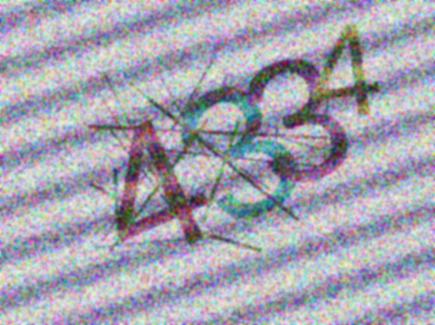

# Captcha Image Preprocess

This repository contains a MATLAB-based pipeline for **Captcha image preprocessing and digit classification**. The goal is to segment individual digits from captcha images and classify them using machine learning methods (KNN and decision tree).

---
## Problem Description

Captcha images in this project are challenging due to:

- **Periodic background noise**: Tilted stripes or grid patterns interfere with segmentation.  
- **Severe digit overlap**: Digits often touch or overlap, making projection-based methods unreliable.  
- **Rotation**: Digit strings may be rotated relative to horizontal.  
- **Stroke complexity**: Thin, multi-colored strokes may intersect artifacts.  
- **Variable length**: Images contain either three or four digits.

## Quick start
- Testing:
  - load trained model 'Mdl_KNN3.mat'
  - Run 'evaluate_classifier.m'
- Training: Run './training/SVN_kfold.m'

## Features

- Preprocessing of captcha images to remove noise and isolate characters
- Digit segmentation using morphological approaches
- Digit Count estimation: select most two important feature with decision tree
  - Bounding box width
  - Skeleton length
- Classification of digit counts using KNN
- Conversion of decision tree model into faster if-else rules
---

## Method Overview

The pipeline consists of the following main steps:

1. **Binarization and noise removal**  
   Convert the captcha image to a binary image and apply cleaning techniques.

2. **Character segmentation (Watershed**  
   Identify connected components and determine if an object represents a single digit or overlapping digits.

3. **Digit Count estimation**  
   To determine which features most strongly influence the number of digits, we perform feature selection using a decision tree to evaluate feature importance (`./train_digit_counter/get_digits_ML.m`). To reduce computational cost, the trained decision tree is converted into a set of if-else statements (`./training/get_digit_total_num.m`, resulting in approximately a 30% reduction in computation time.
   Therefore, if new data is used for training, the digit counter must be retrained using `./train_digit_counter/get_digits_ML.m`, and the resulting model can then be either loaded directly or converted to if-else statements manually.
   
4.  **Segmentation and Optimization**
   Character segmentation combines **k-means clustering** to approximate character positions with **midline adjustment** based on branch points to refine boundaries. This approach handles overlapping characters and varying font sizes, improving segmentation accuracy. Figure below illustrates the adjusted cutting lines based on branch point.

6. **Classification**  
   Train a decision tree to estimate the number of digits based on intensity-based feature with size 28*28. The final model is KNN with 3 neighbors. (`./training/SVN_kfold.m`)

## Result:
The test dataset is 300 images.
- Digit-Level accuracy on the test set: 97.31%.
- Image-Level Accuracy on the test set: 92.61%. 

| Model              | Training (%) | Validation (%) | Test (local) (%) |
|-------------------|-------------|----------------|-----------------|
| **KNN (k=3)**      | **98.58**   | **97.44**      | **92.61**       |
| KNN (k=5)          | 98.36       | 96.87          | 90.12           |
| SVM (Linear kernel)| 87.50       | 88.71          | 66.00           |

